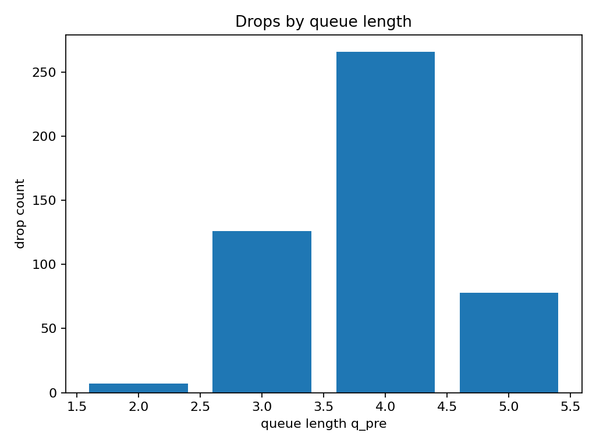
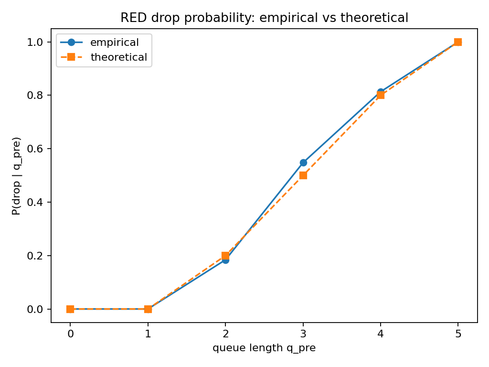
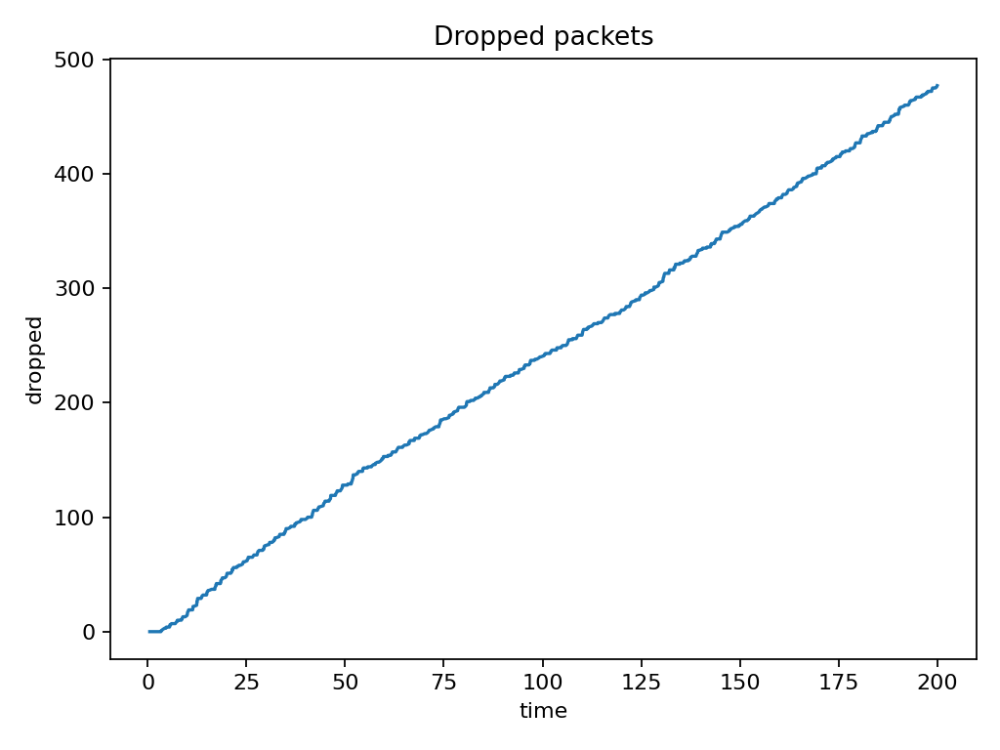
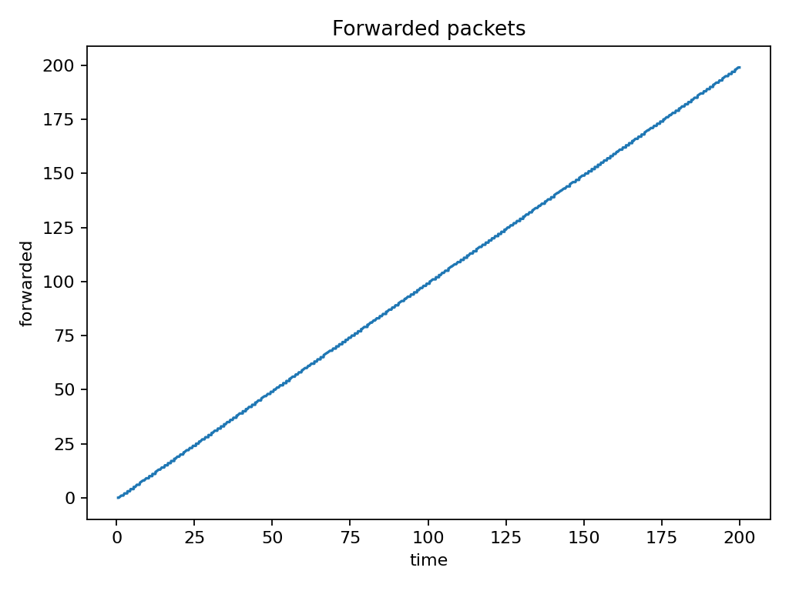
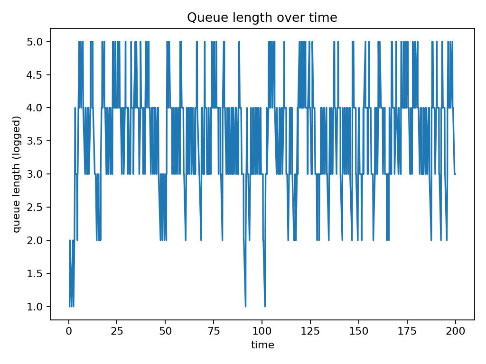
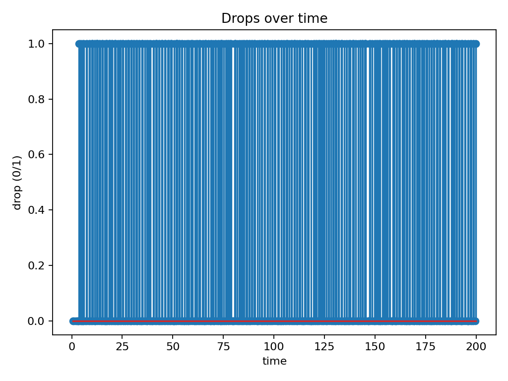
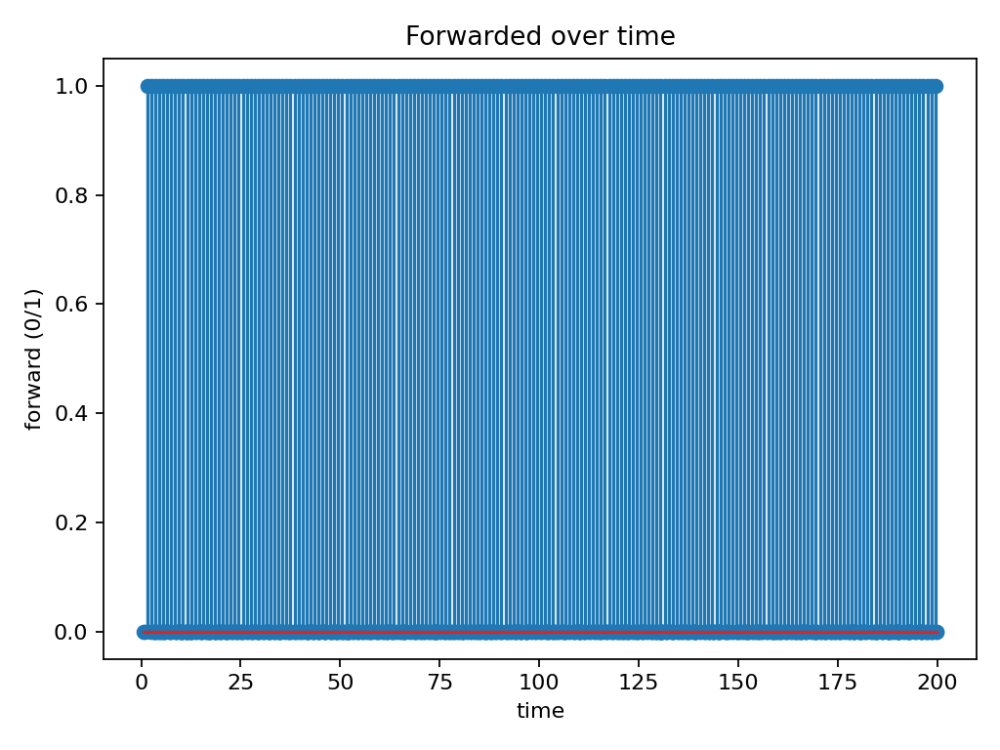

# RED Queue Router

## Design Overview

This project involved the development of a simulation for a network queueing system incorporating Random Early Drop for congestion control. The simulation was structured around three fundamental components:

1.  **A Global Clock:** This central element dictates the temporal ordering and scheduling of all events within the simulation.
2.  **Interactive Components (Router and Sources):** These entities operate reactively, performing actions only when signaled by the global clock.
3.  **An Event Log:** A comprehensive log was maintained to record all significant occurrences and system states throughout the simulation run.

---

## Core Data Structures

The foundation of our simulation relies on a few key data structures:

### `Event`

Events are the atomic units of activity within our simulation, stored in a min-heap data structure, ordered by their `time` attribute. Three primary event types were sufficient for our model:

*   **`TIMER`**: Used to schedule future actions for packet generators.
*   **`ARRIVAL`**: Denotes the moment a packet reaches the router's input.
*   **`DEPARTURE`**: Represents the completion of service for a packet at the router's output.

### `Packet`

`Packet` instances are generated by sources and passed to the router. Each `Packet` encapsulates essential attributes including a unique `id`, `createdAt` timestamp, `sizeBytes`, source, and destination.

### `BoundedQueue`

This structure models the router's buffer as a FIFO queue with a predefined maximum `capacity`. It provides standard queue operations: `push`, `pop`, `front`, `size`, `empty`, and `capacity`.

---

## Components and Their Roles

### Simulator

Acts as the central orchestrator, managing the global clock, scheduling events, and dispatching them to the appropriate components.

*   Maintains a **min-heap** of `Event` objects.
*   The `schedule(Event)` method adds a future event to the heap.
*   The `run(until)` method iteratively:
    1.  Extracts the earliest `Event` from the heap, provided `e.time ≤ until`.
    2.  Advances the internal simulation time (`_now`) to `e.time`.
    3.  **Emits** a `packetEvent` containing `e.nodeId`, `e.pkt`, `e.type`, and `e.time` to notify relevant components.
*   The `record(...)` method forwards simulation data points to the `Metrics` component for collection.

This centralized approach ensures a single authority for time progression and event ordering, allowing other actors to react deterministically to a unified signal, filtering events by their `nodeId`.

---

### Router (RED + Single Server)

Represents the bottleneck link in the network, integrating the RED algorithm for buffer management and a single-server model for packet processing.

*   **State:** Comprises one output `Port` (defined by `txRate` and `propDelay`), a `BoundedQueue` for its buffer, simple counters for statistics, and a Random Number Generator (RNG) for RED's probabilistic dropping.
*   **Connectivity:** Establishes a `Qt::UniqueConnection` to `Simulator::packetEvent` in its constructor, ensuring it receives all relevant events.
*   **Event Filtering:** An internal guard (`if (nodeId != _id) return;`) within its `onEvent` method ensures it only processes events intended for itself.

**Arrival Handling:**

1.  Upon packet `ARRIVAL`, the router queries its current queue length (`qlen`).
2.  It then computes the packet drop probability (`p`) using the RED algorithm based on `qlen`.
3.  A packet is either dropped with probability `p` or if the buffer is at its `capacity`:
    *   Drop counters are incremented, a `congested()` signal is `emit`ted, and `record(queue_len, drop=1, forward=0, t)` is called.
4.  If the packet is accepted, it is pushed into the `BoundedQueue`, and `record(..., drop=0, forward=0, t)` is called.
    *   Crucially, if the queue transitioned from empty to having one packet (0 → 1), a **DEPARTURE** event is scheduled for this packet at `now + 1/txRate + propDelay`.

**Departure Handling:**

*   Upon a **DEPARTURE** event, one packet is popped from the queue and counted as forwarded. `record(..., drop=0, forward=1, t)` is called.
*   If the queue remains non-empty, the next **DEPARTURE** event is scheduled immediately.
*   The "0→1 rule" for scheduling departures prevents the accumulation of multiple departure events for a single head-of-line packet, ensuring efficient processing.

**Congestion Signal:**

*   Each time a packet is dropped, a `congested()` signal is emitted. Packet generators subscribe to this signal to trigger their backoff mechanisms.

---

### Packet Generators

Two identical `PacketGenerator` instances are responsible for generating packet streams following a Poisson distribution and dynamically reducing their offered load in response to congestion signals from the router.

**State:**

*   `_genRate` (packets per unit time), `_txRate` (serialization rate), `_propDelay`.
*   Random Number Generators (RNGs): an exponential distribution for Poisson arrivals and a uniform distribution for backoff jitter.
*   Backoff state variables: `_backoff` flag, `_resumeAt` timestamp, and `_lastResumeScheduled` timestamp for managing backoff periods.
*   A `_ctr` for assigning unique packet IDs.

**Connections:**

*   They listen to `Simulator::packetEvent` but primarily act upon `TIMER` events designated for their specific `nodeId`.
*   They are connected to `Router::congested`, triggering their `onCongested()` method when a drop occurs.

**Key Functions:**

*   `start(at)`: Initializes the generator by scheduling its first **TIMER** event at `at + Exp(_genRate)`.
*   `onEvent(..., TIMER, t)`:
    *   If not currently in a backoff state, `send(t)` is called.
    *   If in backoff and `t ≥ _resumeAt`, the backoff state is cleared, and `send(t)` is called.
    *   Otherwise (in backoff but before `_resumeAt`), the event is ignored.
*   `send(now)`:
    *   Constructs a `Packet`.
    *   Schedules an **ARRIVAL** event for this packet at the router, at `now + 1/_txRate + _propDelay`.
    *   Schedules the next **TIMER** event for itself at `now + Exp(_genRate)`.
*   `onCongested()`:
    *   Calculates a `deadline` for resuming transmission (`now + U(0.5, 1.5)/_genRate`).
    *   If not currently backing off: sets `_backoff=true`, `_resumeAt=deadline`, and schedules **one** resume `TIMER`.
    *   If already backing off: extends `_resumeAt = max(_, deadline)`. A new, later resume `TIMER` is scheduled **only if** this extension pushes `_resumeAt` past the previously scheduled resume time.

This coalesced backoff mechanism demonstrates robustness by effectively reducing the offered load during periods of router congestion, which is visibly reflected in the simulation's metrics.

---

### Metrics

Serves as a straightforward data sink for collecting time-series data from the simulation.

*   Stores parallel `QVector`s to record `times`, `queueLens`, `drops` (binary 0/1), and `forwards` (binary 0/1) for each port.
*   The router invokes `sim.record(...)` on every packet arrival and departure to log these samples.
*   After the simulation `run()` completes, `main.cpp` exports these collected arrays into CSV files.

**Note:** The `queue_len` recorded in `events.csv` represents the **post-event** queue size. The accompanying plotting script performs a conversion for arrivals to derive the **pre-enqueue** queue length, which is crucial for empirically validating the RED curve (specifically, `q_pre = q_logged` if dropped, and `q_pre = q_logged − 1` if accepted).

---

## Data Flow Overview

1.  **Startup**:
    The simulation begins by instantiating the `Simulator`, `Metrics` collector, a `Router` (configured with a capacity of 6 and `txRate=1`), and two `PacketGenerator`s (each with a `genRate=2`). The `router.congested` signal is connected to the `gen.onCongested` slot for both packet sources. Each generator is started with `gen.start(0.0)`, followed by `sim.run(until)` to initiate the simulation.

2.  **TIMER → Send**:
    The simulator dispatches a generator's `TIMER` event. The generator responds by constructing a `Packet`, scheduling its **ARRIVAL** at the router for `now + 1/_txRate + _propDelay`, and then scheduling its own next `TIMER` based on an exponential distribution.

3.  **ARRIVAL → RED/Enqueue**:
    Upon receiving an **ARRIVAL** event, the router evaluates its current `qlen` and applies the RED algorithm. If a packet is dropped, a `congested()` signal is emitted. If accepted, the packet is enqueued, and if the queue was previously empty, the first **DEPARTURE** event for this packet is scheduled.

4.  **DEPARTURE → Forward**:
    During a **DEPARTURE** event, the router removes a packet from the queue, increments its forwarded packet count, and, if the queue is not yet empty, immediately schedules the next **DEPARTURE** event.

5.  **Backoff in Action**:
    During periods of high load and drops, the `_resumeAt` time for generators is extended. Each extension schedules, at most, one later `TIMER` event for resuming transmission. When `_resumeAt` is finally reached, the generator resumes its normal packet sending rate.

6.  **Recording**:
    Every significant event (packet arrival, departure, or drop) triggers a call to `record(...)`. Following the completion of the `run()` method, the accumulated data is exported into CSV files, which are then processed by a Python helper script to generate plots that validate the configured RED curve's behavior.

## Test Results

Below plots are for --until 200 --seed 8121:

samples=878
total_forwarded=199
total_dropped=477

 
 
 
 

 
 